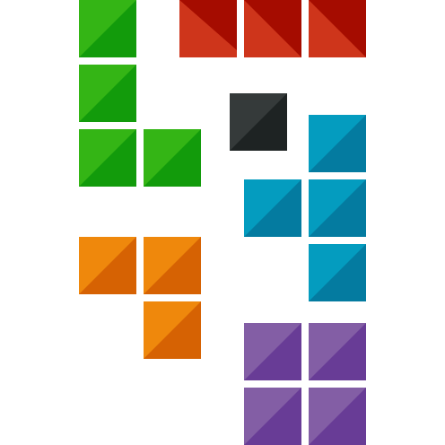

    
  

  <h1 align="center">Tetris</h1>
  <!-- TABLE OF CONTENTS -->
  <h2 id="table-of-contents">:book: Table of Contents</h2>
  

    
Table of Contents

    <ol>
      <li><a href="#about-the-project"> ➤ About The Project</a></li>
      <li><a href="#overview"> ➤ Overview</a></li>
      <li><a href="#howtoinstall"> ➤ How to install</a></li>
      <li>
        <a href="#project-files-description"> ➤ Project Files Description</a>
      </li>
      <li><a href="#Credits"> ➤ Credits</a></li>
    </ol>
  

  
  
  
  <!-- ABOUT THE PROJECT -->
  <h2 id="about-the-project">:pencil: About The Project</h2>
  
  

A tetris artificial intelligence game that evolves itself with its genetic algorithm.
  

  <ul>
    <li>In order to see all scores, press the N button.</li>
    <li>In order to see all weights after scores, press the up or down button after N button.</li>
    <li>In order to see all generations, press the left or right button after N button.</li>
    <li>In order to see main page, press the B button.</li>
    <li>In order to adjust speed of the game, press the up or down button.</li>
  </ul>
  
  
  
  <!-- OVERVIEW -->
  <h2 id="overview">:cloud: Overview</h2>
  

Tetris game with Genetic Algorithm. It has some starting dataS and improves itself every 40 games. Simply, the algorithm takes 5 different weight values applied in the ten highest scoring games and crosses (crossing over) them among themselves.
  

  
    <h2 id="howtoinstall">⛓️ How to install</h2>
  
  

    There are one easy way to deal with it:
  <ol>
    <li>Build the project with ide</li>
      <ul>
         <li> Open the location where all the documents are located in visual studio code, pycharm or any ide that can run python file.</li>
         <li> Run Tetris.py</li>
         <li> You will be able to see the gui.</li>
      </ul>
   </ol>
  

  
  
  <!-- PROJECT FILES DESCRIPTION -->
  <h2 id="project-files-description">📝 Project Files Description</h2>
  
  <ul>
    <li><b>Tetris.py</b> - Where all the main classes.</li>
    <li><b>veriler.csv</b> - Where all the weights for every Population and Generations.</li>
  </ul>

  
  
  <!-- CREDITS -->
  <h2 id="Credits">:scroll: Credits</h2>
  

